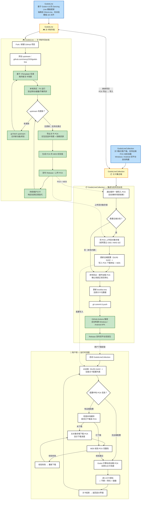

```mermaid
flowchart TB
    classDef blue fill:#bbdefb,stroke:#1565c0,stroke-width:2px
    classDef yellow fill:#fff9c4,stroke:#f57f17,stroke-width:2px
    classDef green fill:#c8e6c9,stroke:#2e7d32,stroke-width:2px
    classDef white fill:#ffffff,stroke:#333333,stroke-width:2px
    classDef pink fill:#ffcdd2,stroke:#c62828,stroke-width:2px
    classDef gray fill:#f5f5f5,stroke:#616161,stroke-width:1px

    %% ===== 顶层项目描述 =====
    GL_DESC["GodotLine<br/>基于 Godot 4.6 的 Dancing Line 模板框架<br/>抽离自 ShinnLine，向冰焰模板 3/4 对齐"]:::blue
    GLC_DESC["GodotLineCollection<br/>关卡集合客户端，支持远端 PCK 动态加载<br/>Windows / Android 双平台自动构建"]:::blue
    
    GL["GodotLine<br/>🎮 关卡制作端"]:::yellow
    GLC["GodotLineCollection<br/>📦 关卡集合端"]:::yellow
    
    GL_DESC --> GL
    GLC_DESC --> GLC
    GL <-- "姊妹项目<br/>PCK 导出 ↔ 导入" --> GLC

    %% ===== GodotLine 侧：关卡制作与导出 =====
    subgraph GL_SIDE["🎮 GodotLine — 关卡制作流水线"]
        direction TB
        
        A1["Fork / 新建 GitHub 项目"]:::white
        A2["添加 upstream：<br/>github.com/meny2333/godot-line"]:::white
        A3["基于 #Template/ 目录<br/>制作新关卡场景"]:::green
        A4["本地测试：F5 运行<br/>验证转向/碰撞/节奏同步"]:::green
        A5{"upstream 有更新？"}:::white
        A6["git fetch upstream<br/>合并新功能/修复"]:::green
        A7["导出关卡 PCK<br/>仅包含选中场景 + 依赖资源"]:::green
        A8["生成 PCK 的 MD5 校验值"]:::green
        A9["发布 Release / 上传 PCK"]:::green
        A10["持续维护关卡<br/>响应玩家反馈迭代"]:::green

        A1 --> A2 --> A3 --> A4 --> A5
        A5 -- "有更新" --> A6 --> A3
        A5 -- "无更新，且测试通过" --> A7 --> A8 --> A9 --> A10 --> A5
    end

    GL --> GL_SIDE

    %% ===== GodotLineCollection 侧：集成与打包 =====
    subgraph GLC_SIDE["📦 GodotLineCollection — 集成与发布流水线"]
        direction TB
        
        B1["通过插件一键导入 PCK<br/>（自动解析场景依赖）"]:::white
        B2{"需要云端分发？"}:::white
        B3["将 PCK 上传至对象存储<br/>（如阿里云 OSS / AWS S3）"]:::white
        B4["更新远端配置（DLRS GAS）<<br/>写入 PCK 下载地址 + MD5"]:::white
        B5["本地验证：插件加载 PCK<br/>确认场景正常实例化"]:::white
        B6["更新 levellist.tres<br/>注册关卡元数据"]:::white
        B7["git commit & push"]:::white
        B8["GitHub Actions 触发<br/>自动构建 Windows / Android APK"]:::green
        B9["Release 发布双平台安装包"]:::green

        B1 --> B2
        B2 -- "是" --> B3 --> B4 --> B5
        B2 -- "否（本地内置）" --> B5
        B5 --> B6 --> B7 --> B8 --> B9
    end

    GLC --> GLC_SIDE

    %% ===== 用户侧：下载 → 验证 → 游玩 =====
    subgraph USER_SIDE["👤 用户侧 — 运行时流程"]
        direction TB
        
        U1["启动 GodotLineCollection"]:::white
        U2["从远端（DLRS GAS）<<br/>拉取关卡配置列表"]:::white
        U3{"配置中有 PCK 信息？"}:::white
        U4["检查本地缓存<br/>是否已下载该 PCK"]:::white
        U5["从对象存储下载 PCK<br/>显示下载进度"]:::white
        U6["MD5 校验 PCK 完整性"]:::white
        U7["校验失败 → 重新下载"]:::white
        U8["Godot 引擎动态加载 PCK<br/>实例化关卡场景"]:::white
        U9["进入关卡游玩<br/>🎵 节奏 + 转向 + 碰撞"]:::white
        U10["关卡结束 → 返回选关界面"]:::white

        U1 --> U2 --> U3
        U3 -- "无远端配置" --> U8
        U3 -- "有远端配置" --> U4
        U4 -- "未下载" --> U5 --> U6
        U4 -- "已下载" --> U6
        U6 -- "校验失败" --> U7 --> U5
        U6 -- "校验通过" --> U8 --> U9 --> U10 --> U2
    end

    %% ===== 跨项目连接 =====
    A9 -. "PCK + MD5" .-> B1
    A9 -. "上传至对象存储" .-> B3
    B4 -. "配置写入" .-> U2
    B9 -. "用户下载安装" .-> U1
```

